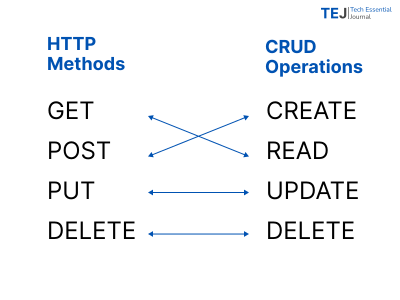

# HTTP methods
_2 min read_

HTTP is a protocol that defines various methods for performing CRUD operations. These methods, outlined by W3.org, are essential for interacting with web APIs. The most commonly used methods for web APIs are
- GET
- POST
- PUT
- DELETE

The following image illustrates which HTTP methods are typically used to perform each CRUD operation. While there is no strict restriction on which methods can be used for different CRUD operations, it is considered industry best practice to use the designated HTTP method for each specific operation.

:::tip 
- Some organizations use the POST method for all CRUD operations. One reason for this is their information security policies.
- For "soft deletes," the POST method is used instead of DELETE. This is because the record is not actually deleted; instead, it is labeled as 'deleted'.