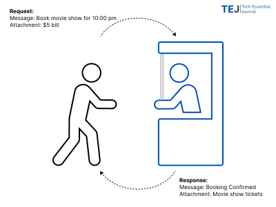

# What is an API?
_1 min read_

API stands for **Application Programing Interface**, is an interface just like your booking counter of a movie theater. You make a request to the person across the counter along with $5 bill and get conformation response along with tickets.

Similarly, we communicate across similar interface inside the theater to get popcorns and our favourit drink. Just like our physical world, where we have interfaces designed for specific purpose to access specific resource, the tech world follows the same principles. For example, we will have an API to get product catelog and a different API to get order history.

Next,  will explore the fundamental operations performed by the APIs.